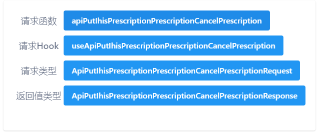

# ytt-api-copy - YAPI-to-Typescript Tampermonkey Plugin


[中文](README.md) | English



## Project Overview

ytt-api-copy is a Tampermonkey plugin that allows you to copy the request function name, the corresponding React Hook name, the request parameter type name, and the request parameter return value name generated by the yapi-to-typescript tool on the yapi interface. yapi-to-typescript is a powerful tool used to convert yapi interface data into TypeScript type declaration files. With this Tampermonkey plugin, you can easily copy the request function name, the corresponding React Hook name, the request parameter type name, and the request parameter return value name while viewing the yapi interface, greatly improving frontend development efficiency.

## Features

- **Copy Request Function Name:** With a click on the plugin button on the yapi page, the current request's function name will be automatically copied, making it convenient for direct usage in the project.

- **Copy Corresponding React Hook Name:** For projects using React Hook, the plugin can copy the corresponding React Hook name for the current request, simplifying code writing.

- **Copy Request Parameter Type Name:** Quickly copy the parameter type name of the current request, eliminating the need for manual searching and defining.

- **Copy Request Parameter Return Value Name:** Similarly, the plugin can copy the return value type name of the current request, reducing the need for manual type definition.

## Usage

1. First, ensure that you have installed Tampermonkey or another browser extension that supports Tampermonkey plugins.

2. Download and install this Tampermonkey plugin.

3. Open the yapi page and navigate to the interface you want to view.

4. Click the plugin button and copy the request function name, React Hook name, request parameter type name, or request parameter return value name as needed.

5. Paste the copied content into your code and import the types or functions generated by yapi-to-typescript using your IDE's code completion capability.

## yapi-to-typescript Configuration

Before using yapi-to-typescript to generate types and request functions, you must add the following configuration to the yapi-to-typescript configuration file:

```javascript
getRequestFunctionName(interfaceInfo, changeCase) {
  return changeCase.camelCase(
    `api${interfaceInfo.method}${interfaceInfo.path}`
  );
}
```

The type and function names generated based on the above configuration must match the type and function names copied by ytt-api-copy.

## License

This project is licensed under the MIT License. For details, please refer to the [LICENSE](LICENSE) file.

## Tampermonkey Plugin Link

You can find the ytt-api-copy Tampermonkey plugin [here](https://greasyfork.org/zh-CN/scripts/465481-ytt-api-copy).
